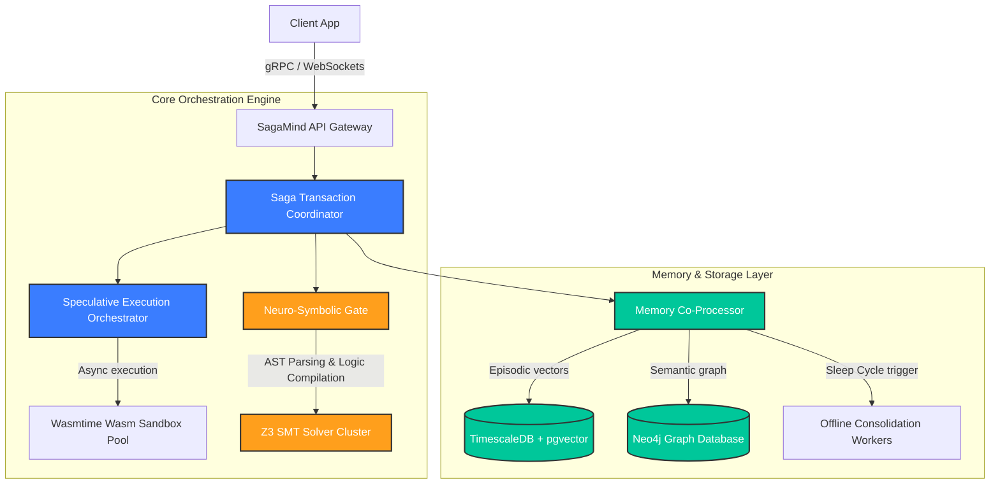
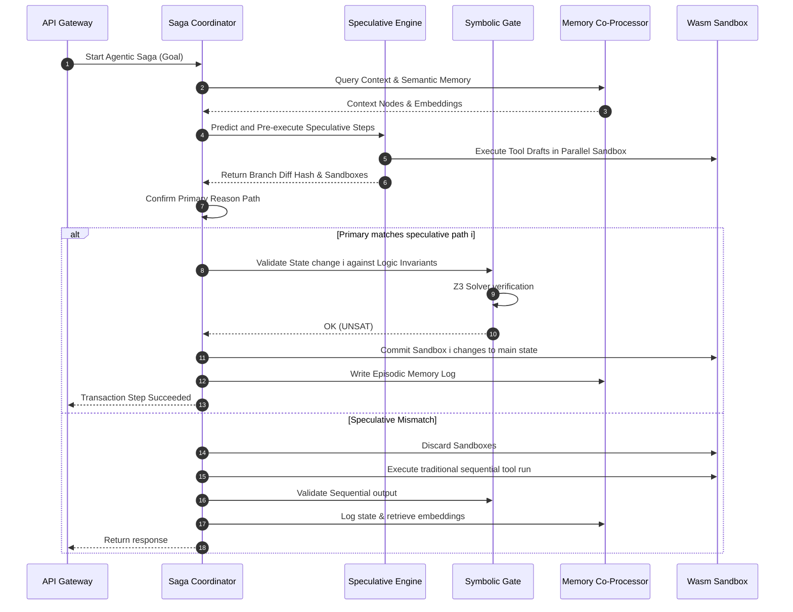
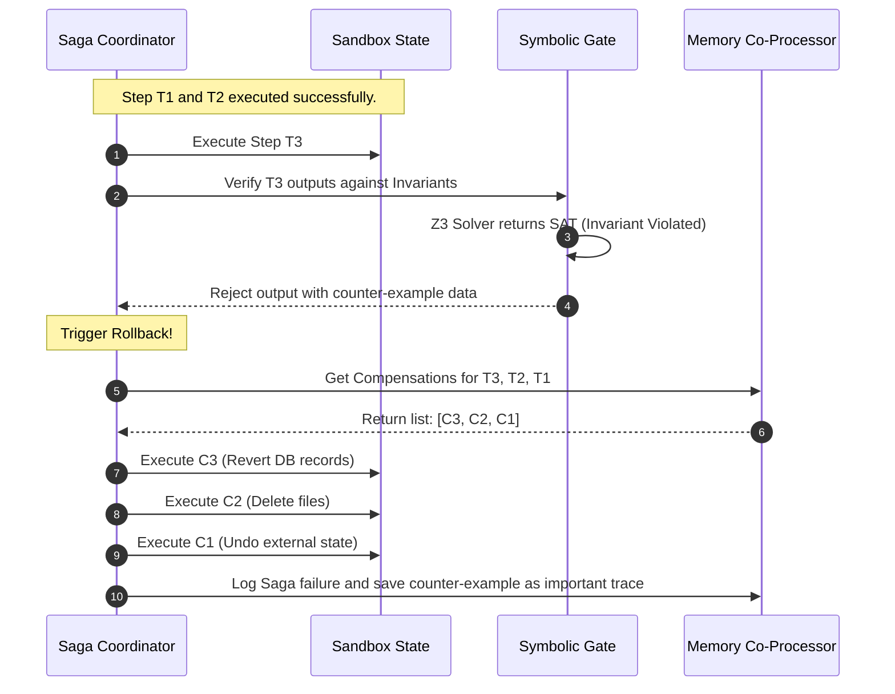

# SagaMind: System Architecture and Subsystem Specifications

This document outlines the engineering specifications, network protocols, isolation mechanisms, and database structures of the **SagaMind** transaction-safe runtime.

---

## 1. Subsystem Decomposition

SagaMind is built on an asynchronous, message-driven, high-performance architecture. The core execution engine is written in **Rust** to optimize token processing speed and guarantee safety across parallel threads.



---

## 2. Technical Architecture of Core Subsystems

### 2.1 Saga Transaction Coordinator (STC)
The STC oversees the execution of distributed multi-agent pipelines. 
*   **State Machine:** Implemented as a stateful event-sourced engine. Transitions are logged to an append-only transaction ledger in Redis for performance and sub-millisecond recovery.
*   **Rollback Protocol:** If a step fails verification, the STC queries the Memory Co-Processor to retrieve compensating actions. The STC then coordinates rollbacks (LIFO order) in isolated environments.

### 2.2 Memory Co-Processor (MCP)
Decoupled from primary inference, the MCP processes memory updates in the background.
*   **Episodic Store (TimescaleDB):** Captures high-frequency temporal interaction logs. Uses Timescale hypertables partitioned by `timestamp` and tenant IDs. Includes an HNSW vector index for high-speed cosine similarity lookup of embeddings.
*   **Semantic Graph (Neo4j):** Maps generalized conceptual clusters. This graph is queryable by Cypher queries, allowing agents to navigate relational systems context.
*   **Consolidation Workers:** Triggers background DBSCAN clustering of episodic logs during low-load periods, compiling concepts using a specialized summarization model.

### 2.3 Neuro-Symbolic Gate (NSG)
Bridges the probabilistic output of LLMs with safety verification systems.
*   **Translation Engine:** Converts output JSON schemas into first-order logical representations.
*   **SMT Verification Service:** Interfaces directly with a cluster of Z3 solvers via standard input/output streams over Unix sockets for sub-millisecond performance.

### 2.4 Speculative Execution Orchestrator (SEO)
Maximizes system throughput by pre-computing likely tool execution paths.
*   **Drafter Agent:** Lightweight models (e.g. 8B parameter models) predict the next tool call parameters.
*   **Sandbox Pools:** WebAssembly (Wasm) isolated containers execute tool actions inside Copy-on-Write (COW) file systems, preserving host state.

---

## 3. Communication and Data Sequences

### 3.1 Normal Flow: Transaction Verification and Log


### 3.2 Rollback Flow: Eventual Consistency Restoration


---

## 4. Sandbox Isolation and Containerization

SagaMind enforces strict boundaries between agent processes and physical host resources.

```
       +---------------------------------------------+
       |             Host Operating System           |
       +---------------------------------------------+
                              |
              +---------------+---------------+
              |                               |
              v                               v
+--------------------------+    +--------------------------+
|  Sandbox 1: Wasmtime VM  |    |  Sandbox 2: Wasmtime VM  |
|  - Limits: 256MB RAM     |    |  - Limits: 256MB RAM     |
|  - COW File System       |    |  - COW File System       |
|  - Outbound Proxy Gate   |    |  - Outbound Proxy Gate   |
+--------------------------+    +--------------------------+
```

1.  **Memory Limits:** Each sandbox runs in a dedicated WebAssembly (Wasmtime) runtime instance, capped at 256MB memory.
2.  **File System Virtualization:** Sandboxes use Copy-On-Write (COW) disk mounts. Any mutations made by speculative drafts are saved in temporary memory overlays, protecting the base filesystem from modification.
3.  **Outbound Network Proxying:** All external HTTP/gRPC requests are forced through a system gateway proxy that runs validation checks on request headers, filters against whitelists, and rate-limits agent API calls.
